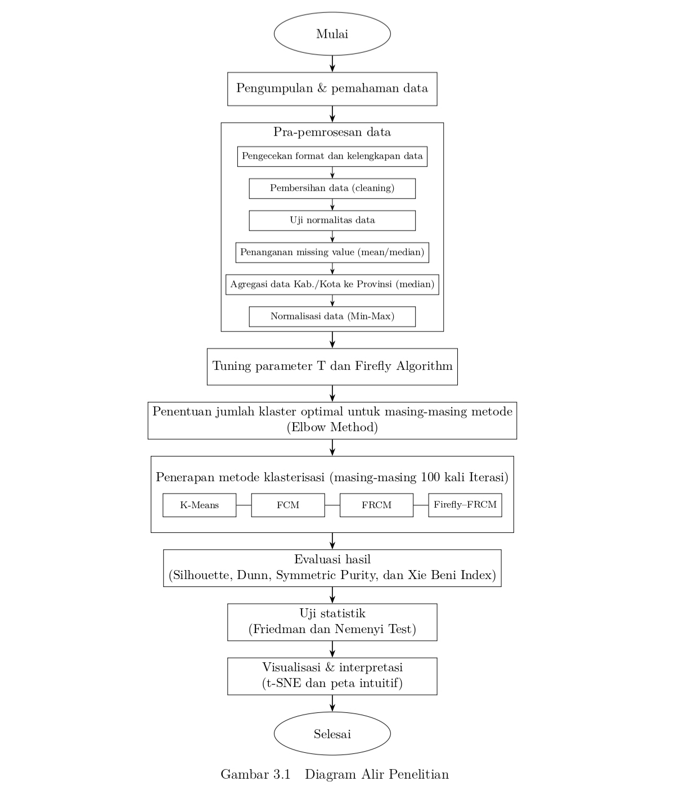

# Perbandingan Metode Klasterisasi Berbasis Hard, Fuzzy, dan Metaheuristik-Fuzzy Rough untuk Analisis Data Sampah Antarprovinsi di Indonesia

## Deskripsi Penelitian

Penelitian ini bertujuan membandingkan performa metode klasterisasi berbasis hard, fuzzy, dan metaheuristik-fuzzy rough dalam mengelompokkan karakteristik sampah antarprovinsi di Indonesia menggunakan data Sistem Informasi Pengelolaan Sampah Nasional (SIPSN) periode 2019–2025.

Metode yang dibandingkan meliputi:

* K-Means
* Fuzzy C-Means (FCM)
* Fuzzy Rough C-Means (FRCM)
* Firefly Algorithm Fuzzy Rough C-Means (FA-FRCM)

Evaluasi dilakukan menggunakan Silhouette Score, Dunn Index, Symmetric Purity, dan Xie-Beni Index. Perbedaan performa metode diuji menggunakan Friedman Test dan Nemenyi Test.

## Diagram Alir Penelitian

<p align="center">
  
</p>

<p align="center">
  Diagram alir penelitian tugas akhir.
</p>

## Tahapan Penelitian

1. Pengumpulan dan pemahaman data SIPSN (2019–2025)
2. Pra-pemrosesan data
3. Tuning parameter FRCM dan FA-FRCM
4. Penentuan jumlah klaster optimal
5. Penerapan algoritma klasterisasi
6. Evaluasi hasil klasterisasi
7. Uji statistik
8. Visualisasi dan interpretasi hasil

## Struktur Repository

```text
Dataset/         -> Dataset mentah dan hasil agregasi
PREPROCE/        -> Pra-pemrosesan data
TUNING/          -> Tuning parameter FRCM dan FA-FRCM
ELBOW/           -> Penentuan jumlah klaster optimal
KLASTER_DATA/    -> Hasil klasterisasi
EVALUASI/        -> Silhouette, Dunn, SP, XB
UJI STATIS/      -> Friedman dan Nemenyi Test
VISUALISASI/     -> t-SNE dan peta klaster
Dashboard/       -> Dashboard hasil analisis
```

## Tools

* Python
* Pandas
* NumPy
* Scikit-Learn
* Matplotlib
* GeoPandas
* QGIS

## Penulis

Raissa Undita
Departemen Matematika
Institut Teknologi Sepuluh Nopember (ITS)
