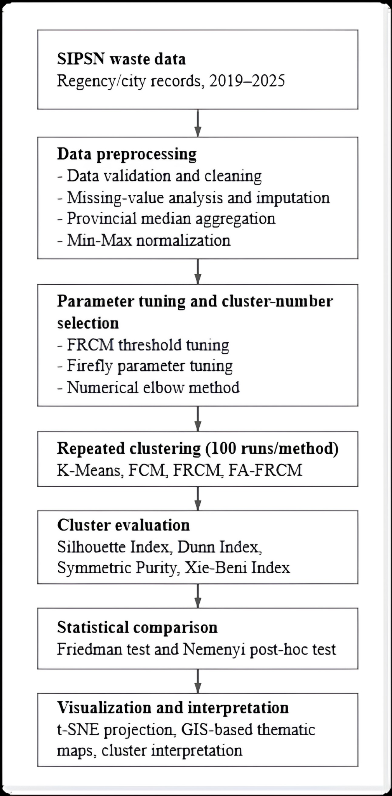

# Assessing spatial and temporal patterns in provincial waste profiles in Indonesia using hard, fuzzy, and fuzzy-rough clustering

## Research Overview
Waste management in Indonesia exhibits substantial spatial and temporal variation in waste generation, composition, and sources. National-level statistics may obscure these regional differences, making data-driven approaches useful for characterizing heterogeneous waste profiles and examining how they change over time.

This study uses waste-monitoring data reported through the National Waste Management Information System (Sistem Informasi Pengelolaan Sampah Nasional, SIPSN) for the period 2019–2025 to assess spatial and temporal heterogeneity in waste characteristics across Indonesian provinces.

The original SIPSN records are reported at the regency/city level and contain information on waste generation, waste composition, and waste sources. After data cleaning, missing-value handling, aggregation, and normalization, the observations are analyzed at the provincial level.

The study compares four clustering approaches with different representations of cluster membership:
* K-Means
* Fuzzy C-Means (FCM)
* Fuzzy Rough C-Means (FRCM)
* Firefly–Fuzzy Rough C-Means (Firefly-FRCM)
  
The methodological comparison examines how different representations of cluster membership perform when applied to heterogeneous tabular waste-monitoring data. In particular, fuzzy and fuzzy-rough approaches are considered for their ability to represent provinces whose waste characteristics may overlap or fall near cluster boundaries.

Cluster quality is evaluated using multiple complementary criteria:
* Silhouette Index
* Dunn Index
* Symmetric Purity
* Xie-Beni Index

The Silhouette, Dunn, and Symmetric Purity indices are used for comparison across all four methods, while the Xie-Beni Index is applied to the fuzzy-based approaches. Repeated runs with different random initializations are used to assess performance variability and stability.

Differences in clustering performance are statistically evaluated using the Friedman test followed by the Nemenyi post-hoc test.

Beyond methodological comparison, the selected clustering solution is used to characterize provincial waste profiles and their spatial-temporal changes during 2019–2025. Cluster profiles are examined through attribute distributions and dimensionality-reduction visualization, while GIS-based thematic maps are used to visualize the geographic distribution and changes in cluster membership across Indonesian provinces.

The resulting clusters are interpreted as descriptive waste profiles that represent relative similarities among province-year observations. They are intended to support the assessment of spatial and temporal heterogeneity in waste characteristics rather than serve as direct measures of environmental risk, causal classifications, or standalone policy recommendations.

## Monitoring and Spatial Visualization Dashboard

An interactive dashboard was developed to provide a visual representation of the clustering results and facilitate exploration of provincial waste profiles over time.

The dashboard allows users to:

* Select a specific year from 2019 to 2025
* View the FRCM clustering map by province
* Examine the spatial distribution of provincial waste profiles
* Distinguish provinces according to their assigned cluster
* Identify provinces located near fuzzy-rough cluster boundaries
* Explore province-level clustering information through interactive tables
* Observe changes in provincial cluster membership across different years

The dashboard is intended as a visual monitoring and exploration interface for the analytical results, complementing the statistical and spatial assessment presented in the study.

Dashboard Preview

  
 
 <em>Interactive dashboard for exploring spatial and temporal patterns in provincial waste profiles based on the selected FRCM solution.</em> 

## Research Workflow

  

  Research workflow of the final project.

## Research Stages

1. Waste-Monitoring Data Collection
Waste data were obtained from the National Waste Management Information System (SIPSN) for the 2019–2025 period. The dataset contains provincial-level information derived from regency/city records, including:
   - Waste generation
   - Waste composition
   - Waste sources

The analysis focuses on identifying relative similarities among provinces and province-year observations.
2. Data preprocessing
   - Data format and completeness checking
   - Data cleaning
   - Normality testing
   - Missing value handling
   - Regency/city-level data aggregation to the provincial level
   - Min-Max normalization
3. Parameter tuning for FRCM and Firefly-FRCM
4. Determination of the optimal number of clusters using the Elbow Method
5. Application of the clustering algorithms
6. Clustering performance evaluation
7. Statistical analysis using the Friedman and Nemenyi Tests
8. Provincial Waste-Profile Assessment
9. Spatial and Temporal Assessment
Cluster membership is examined across provinces and years to identify:
   - Spatial differences in waste profiles
   - Temporal changes in cluster membership
   - Provinces with relatively stable profiles
   - Provinces exhibiting changes in their waste-profile classification

GIS-based thematic maps are used to visualize these patterns geographically.
10. Interactive Dashboard
The final clustering results are incorporated into an interactive dashboard to facilitate exploration of provincial waste profiles.
The dashboard provides a year-by-year spatial view of the selected FRCM solution and allows users to explore provincial clustering information interactively.

## Repository Structure

* Dataset/         -> Raw and aggregated datasets
* PREPROCE/        -> Data preprocessing
* TUNING/          -> Parameter tuning for FRCM and Firefly-FRCM
* ELBOW/           -> Optimal cluster number determination
* KLASTER_DATA/    -> Clustering results
* EVALUASI/        -> Silhouette, Dunn, Symmetric Purity, and Xie-Beni evaluation
* UJI STATIS/      -> Friedman and Nemenyi statistical tests
* VISUALISASI/     -> t-SNE and cluster map visualizations
* Dashboard/       -> Interactive analysis dashboard

## Tools and Libraries
* Python
* Pandas
* NumPy
* SciPy
* Scikit-Learn
* Optuna
* Matplotlib
* GeoPandas
* QGIS

## Author
Raissa Undita Estiningtyas  
Department of Mathematics  
Faculty of Science and Data Analytics  
Institut Teknologi Sepuluh Nopember (ITS)  
Surabaya, Indonesia
